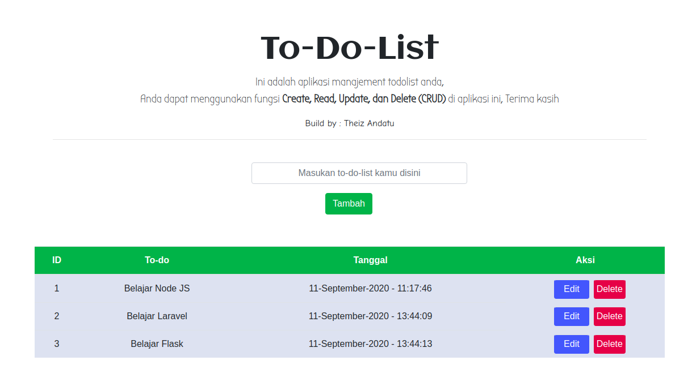

### Flask App ToDo-List

#### How to run This Project

* git clone https://github.com/antroytheiz/Flask-ToDo.git
* cd Flask-Todo
* python -m venv python-env
* source python-env/bin/activate/
* pip install -r requirements.txt
* python run.py
* open your browser and typing _localhost:5000_

### Thank You
* Build by Theiz Andatu
* Record this Project, you can check in this [YouTube](https://www.youtube.com/watch?v=aQak27DrAMw)

